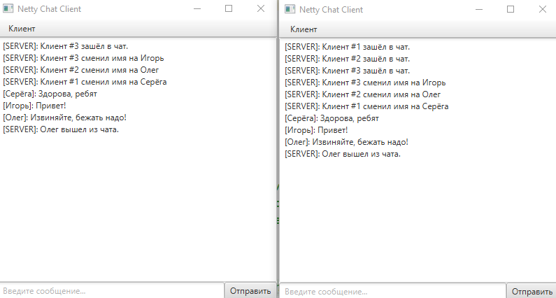

## Netty_chat

Простой проект сетевого чата на Java и Netty, созданный по вебинару GeekBrains.
Был создан для тестирования клиент-серверного взаимодействия через сокет с помощью Netty. Визуальная часть 
клиентской стороны выполнена с помощью JavaFX. 
На серверной стороне ведётся логирование действий клиентов в консоль и файл.

Если Вам будет интересно самому пройти данный урок и изучить принципы создания простого чата с помощью 
сокетов, то вот ссылка: https://www.youtube.com/live/2UyJRQMrosA?si=BM2rfkOc3_iK4XdD 

### Требования к окружению / Используемые технологии:
* Java 17,
* Apache Maven 3.8.4
* Netty 4.1
* JavaFX 17.0.1
* Lombok 1.18.30
* Log4j 1.2.17

##### Запуск проекта:
```
Проект тестовый и запускается через IDE:
Для его запуска нужно запустить серверную часть приложения из папки "netty-chat-server" 
А также одну или несколько клиентских частей из папки "netty-chat-client".
После этого откроются окна чата со всем знакомым типом взаимодействия. 
```
##### Пример чата:


### Контакты для связи:
> <a href="https://github.com/Niaktes/">Захаренко Сергей</a> <br>
> Телефон: +7 995 299 07 34 <br>
<a href="https://t.me/Niaktes"></a>
<a href="https://wa.me/89265900734"></a>
<a href="mailto:Sergei.Rabota@gmail.com"></a>